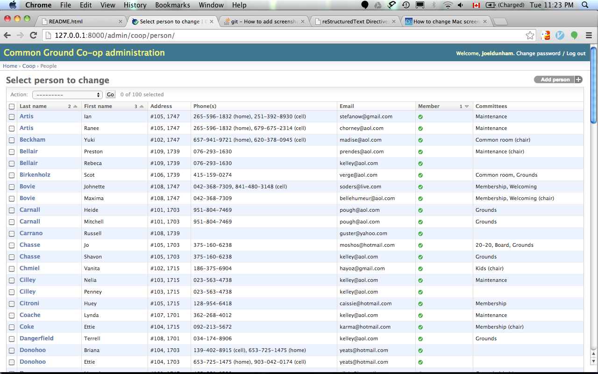

================================================================================
  Common Ground (CG) Co-op Web Site
================================================================================

A web application for the Common Ground Housing Co-op.

This repository is a Django (v. 1.6) web application for the Common Ground
Co-op web site. It is currently in the requirements gathering and development
stage.  Feel free to use this for your own housing co-op, or to contribute to
the development process.

.. contents:: Table of Contents

QuickStart
================================================================================

Assuming you have Django 1.6 installed correctly, the following commands will
download the web app, create the database tables, load them with some fake data,
and start the live server.::

    $ git clone https://github.com/jrwdunham/cghousing.git
    $ cd cghousing
    $ python manage.py syncdb
    $ python manage.py loaddata coop/fixtures/fixtures.json
    $ python manage.py runserver

Voila! Visit http://127.0.0.1:8000/admin/coop/person/ to see a bunch of pretend
co-op members/occupants. Begin exploring the admin site that Django creates for the
co-op model by 

This is all standard Django stuff. See https://docs.djangoproject.com/en/1.6/
for details.

Architecture (thanks to Derek Darling)
================================================================================

- Public

  - About Us

    - Content ("about us subpage")
    - Picture gallery
    - Video gallery
    - Essays and/or blogs (?)
    - Contact Us (Email, Housing requests, Vendor, email hub)
    - Maps (google, or OpenStreetMap)

- Private (authentication required, authorization determines access)

  - Board Page (for all governance materials: minutes, policies, etc.)

    - Menu

      - Board minutes
      - Policies, In Force, including amendments
      - Draft policies and amendments
      - Communications

  - Maintenance Site (for all physical plant records, maintenance requests,
    and disposition (sic))

    - Menu

      - All-member access

        - Unit Database
        - Maintenance Requests
        - Purchase Order Subsystem
        - Inventory

      - Maintenance-only access

        - Discussion

  - Finance (content to be determined)

    - Annual reports (?)

  - Email Hub (for all emailing, including archived email)

    - Email Admin

      - Forms

        - Maintenance request via Email form
        - Housing request via Email form
        - Vendor Email form
        - Other

      - Subsystems
        - Auto-send email subsystem
        - Moderated email subsystem

  - Member Page

    - Maintenance request (directs to maintenance page email forms system (?))
    - Upcoming events
    - Member meeting minutes
    - Discussion groups
    - Etc./other
    - Committees

      - Maintenance (to maintenance page)
      - Grounds (to Grounds page)
      - Social (to Social page)
      - Finance (to Finance page)
      - Other (to Other page)

    - Calendar (automated email reminders, events)

Model
--------------------------------------------------------------------------------

Models to start off with:

- Members
- Committees
- Units
- Pages

These are some ideas for database tables/ models for the application (based on
the architecture):

- Units
- Members
- Committees
- Minutes / Meetings (?)
- Board minutes
- Committee minutes
- Policies (?)
  Contributions (?, i.e., for keeping track of volunteership and involvement)
- Maintenance requests
- Galleries (subtype of pages?)
- Images
- Blogs
- Pages (special and generic pages, markdown)
- Inventory (?)
- Purchase orders
- Member discussion forum
- Maintenance private discussion forum
- Annual reports (finance)
- Communications (?, from board...)
- Emails (part of db?)
- Email forms/templates (part of db?)
- Calendar/Events

Installation Help
================================================================================

Installing Django locally
--------------------------------------------------------------------------------

I used pyenv (https://github.com/yyuu/pyenv) to install Python 2.7.6::

    $ pyenv install 2.7.6

Then I created a virtual Python environment in ~/cg/env/::

    $ cd ~/cg
    $ virtualenv -p ~/.pyenv/versions/2.7.6/bin/python env

I make sure that ``python`` points to my virtual environment in ~/cg/env/ and
then I install the latest official version of Django using pip (1.6.5 at the time
of writing)::

    $ source env/bin/activate
    $ pip install Django

Installing Django on BlueHost
--------------------------------------------------------------------------------

For instructions on installing Django on BlueHost, see

http://blog.ruedaminute.com/2011/01/2011-installation-instructions-for-django-on-bluehost/

